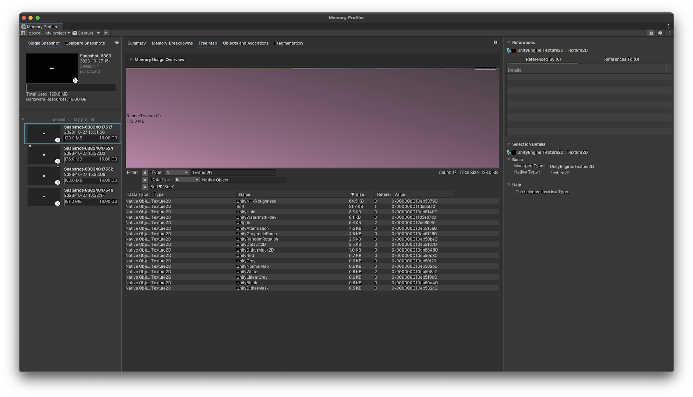
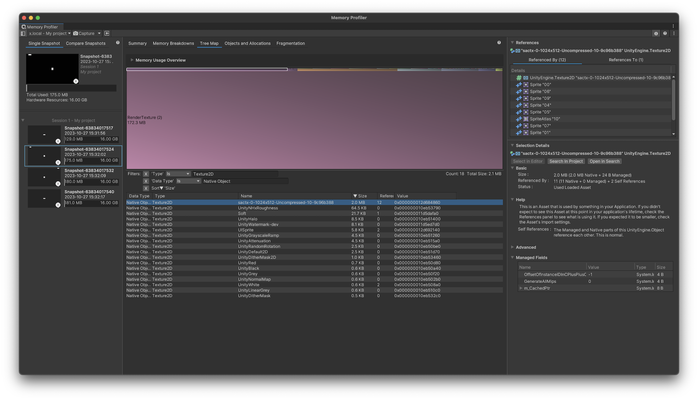
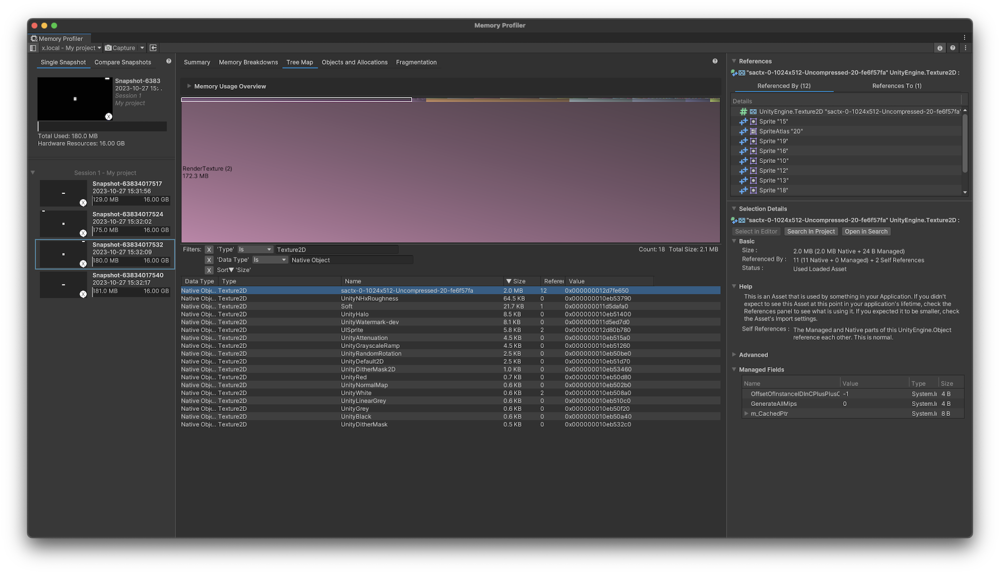

# Test Unity Atlas Release In Addressables

## Scenes

* StartScene - Start scene
* AddrScene1 - Addressables scene 1
* AddrScene2 - Addressables scene 2

## Path

* Load StartScene On Start
* Load AddrScene1 On Button Click With Addressables
* Load AddrScene2 On Button Click With Addressables
* Load StartScene On Button Click Directly

## Memory Snapshots

